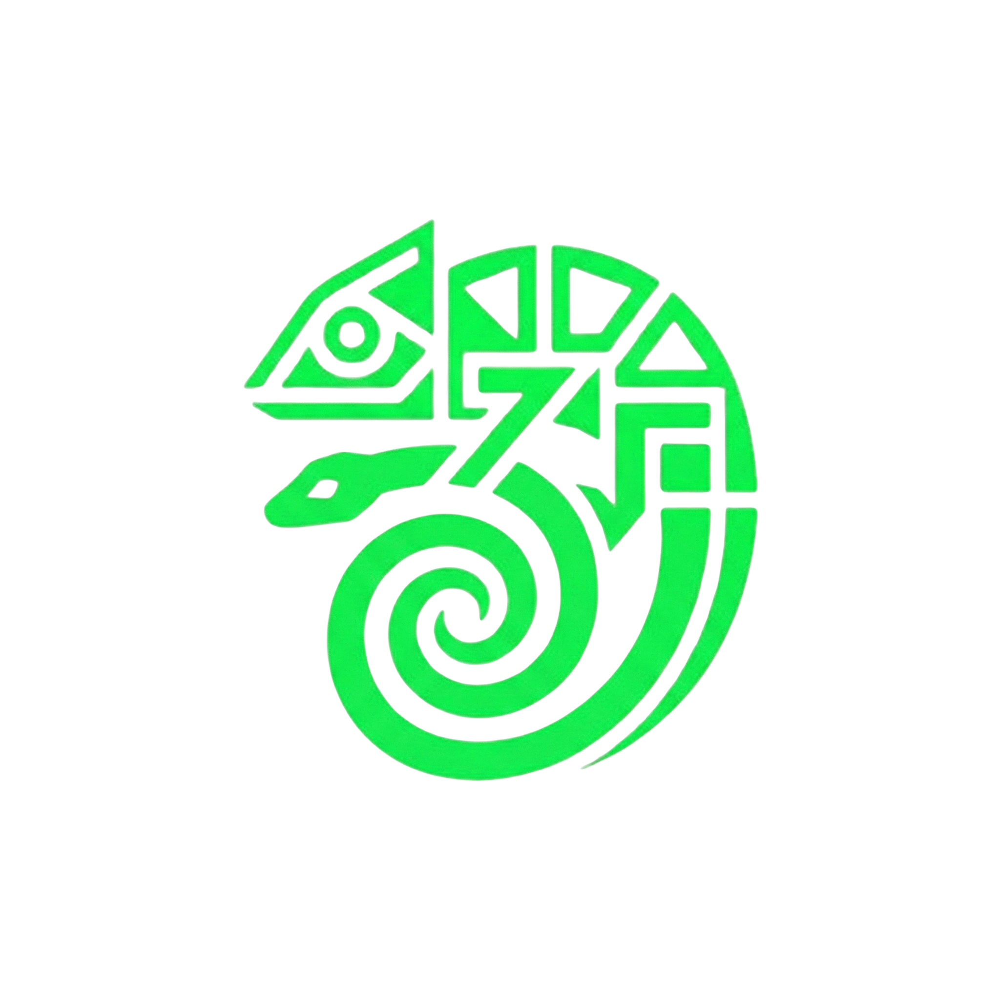

<div align="center">
  
  <h1>Aquilia</h1>
  <p><strong>The speed of a microframework. The reliability of an enterprise engine.</strong></p>

  [](https://aquilia.tubox.cloud)
  [](LICENSE)
  [](https://www.python.org/)
</div>

---

**Aquilia** is a Manifest-First, async-native Python framework designed to bridge the gap between developer velocity and production-grade stability. It removes routing and deployment boilerplate, auto-generates infrastructure manifests (Docker/K8s), and comes with built-in MLOps capabilities.

## 🚀 Why Aquilia?

Current frameworks force a trade-off: use a microframework for speed but spend months on infrastructure, or use a "batteries-included" monolith that's hard to scale and deploy. Aquilia changes the game:

- **Manifest-First Architecture**: Your code define its own infrastructure. No more manual Dockerfile or K8s YAML maintenance.
- **Scoped Dependency Injection**: Built-in, enterprise-grade DI that handles complex lifecycles and provides deep observability.
- **Async-Native Core**: Built for modern, high-concurrency workloads from the ground up.
- **Integrated MLOps**: Native support for artifact versioning, lineage tracking, and model deployment.

## 📦 Installation

```bash
pip install aquilia
```

Or use the CLI to initialize a new project:

```bash
aq init my-awesome-app
```

## ⚡ Quick Start

Create a controller in `app/controllers.py`:

```python
from aquilia import Controller, GET, RequestCtx

class HelloWorld(Controller):
    @GET("/")
    async def hello(self, ctx: RequestCtx):
        return {"message": "Hello from Aquilia!"}
```

Register it in your `manifest.py`:

```python
from aquilia import AppManifest, ServiceConfig

class MyManifest(AppManifest):
    name = "main"
    version = "1.0.0"
    controllers = ["app.controllers:HelloWorld"]
```

## 🏛️ Core Pillars

### 1. The Manifest System
The `AppManifest` is the single source of truth for your application's requirements. It declares controllers, services, middleware, and database configurations. Aquilia uses this manifest to auto-generate:
- **Dockerfiles** tailored to your dependencies.
- **Kubernetes Manifests** for production-ready deployments.
- **OpenAPI Documentation** for your APIs.

### 2. Scoped Dependency Injection
Forget globals. Aquilia provides a hierarchical DI system:
- **Singleton**: Service lives for the app lifecycle.
- **App**: Scoped to the module level.
- **Request**: Fresh instance for every incoming HTTP request.

### 3. Integrated MLOps
Aquilia treats machine learning as a first-class citizen:
- **Artifact Registry**: Version and track data/model assets.
- **Lineage Tracing**: Know exactly which code produced which model.
- **Shadow Deployments**: Test new models in production without affecting real traffic.

## 🛠️ Subsystems

Aquilia is composed of several deeply integrated subsystems:
- **Aquilary**: The core registry and manifest loader.
- **Flow**: Typed routing and composable request pipelines.
- **Faults**: Structured error handling with recovery domains.
- **Mail/Cache/Sessions**: Essential services with enterprise interfaces.

## 🧪 Testing

Run the full unit test suite:

```bash
python -m pytest tests/ -v
```

Run the auth e2e regression suite (102 tests, no Docker required):

```bash
python -m pytest tests/e2e/auth/ -v --junitxml=tests/e2e/auth/report.xml
```

## 🌐 Learn More

- **Documentation**: [https://aquilia.tubox.cloud](https://aquilia.tubox.cloud)
- **Architecture Guide**: [Architecture](https://aquilia.tubox.cloud/docs/architecture)
- **Quick Start**: [Get Started](https://aquilia.tubox.cloud/docs/quickstart)

---

<p align="center">Built with ❤️ by the Aquilia Team</p>
